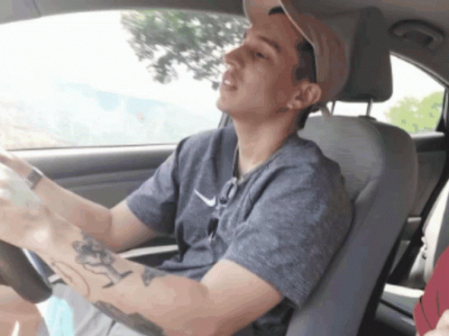

# Drowsy Driver Detection System

This project is a real-time drowsiness detection system that uses a pre-trained Keras model to detect drowsiness from live video input. The system detects faces and eyes, preprocesses the detected face regions, and predicts drowsiness using a convolutional neural network (CNN). If drowsiness is detected, an alert sound is played to wake up the driver.

## Features

- Real-time face and eye detection using OpenCV.
- Drowsiness detection using a pre-trained Keras model.
- Alerts the driver with a sound if drowsiness is detected.

  

## Dependencies

- Python 3.x
- OpenCV
- TensorFlow
- NumPy
- argparse
- playsound

## Installation

1. Clone the repository:

    ```bash
    git clone https://github.com/0304ajay/Drowsy_Driver.git
    cd drowsy-driver-detection
    ```

2. Install the required Python packages:

    ```bash
    pip install opencv-python-headless tensorflow numpy argparse playsound
    ```

3. Download the pre-trained Keras model and place it in the appropriate directory:

    ```plaintext
    drowiness_new6_1.h5
    ```

4. Download the Haar cascades for face and eye detection and place them in the appropriate directory:

    ```plaintext
    haarcascade_frontalcatface.xml
   haarcascade_eye_tree_eyeglasses.xml
    ```

5. Download or place the alert sound file in the appropriate directory:

    ```plaintext
    beep-01a.wav
    ```

## Usage

To run the Drowsy Driver Detection system, execute the following command:

```bash
python drowsy_driver_detection.py --face_cascade "haarcascade_frontalcatface.xml" --eyes_cascade "haarcascade_eye_tree_eyeglasses.xml" --camera 0
